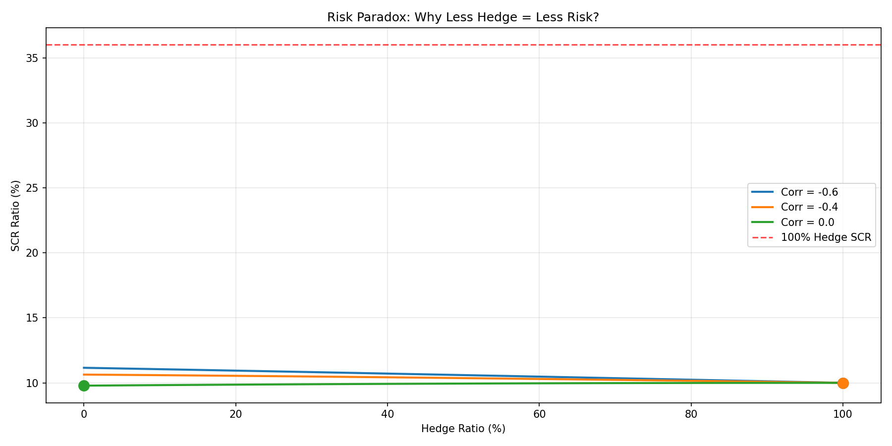
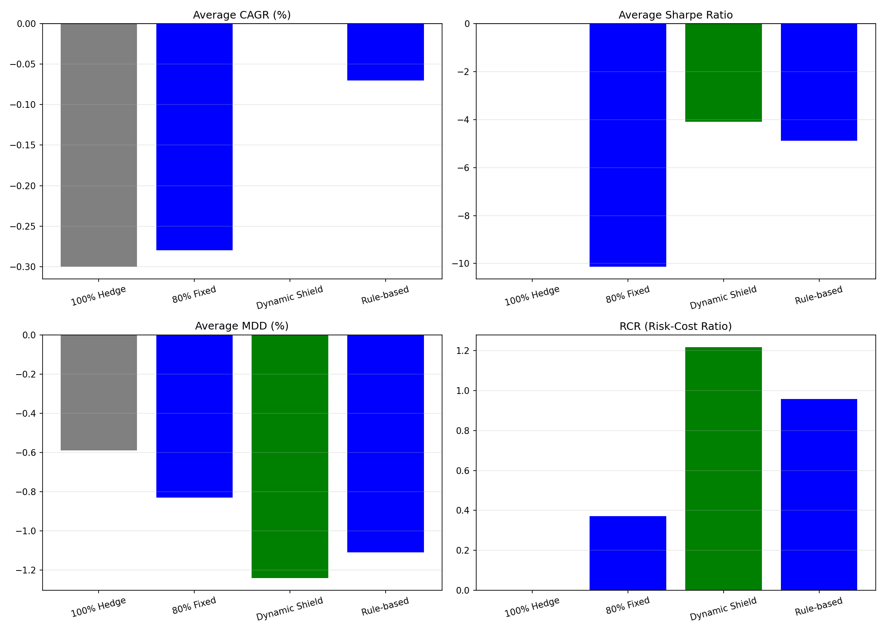
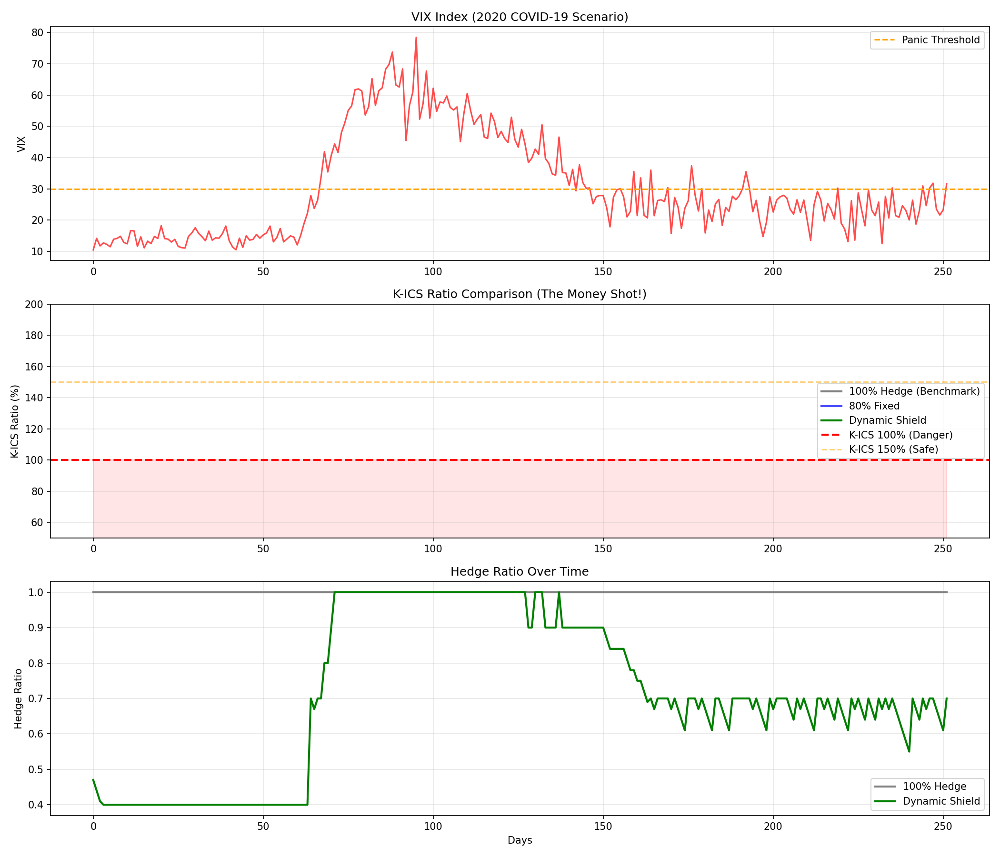
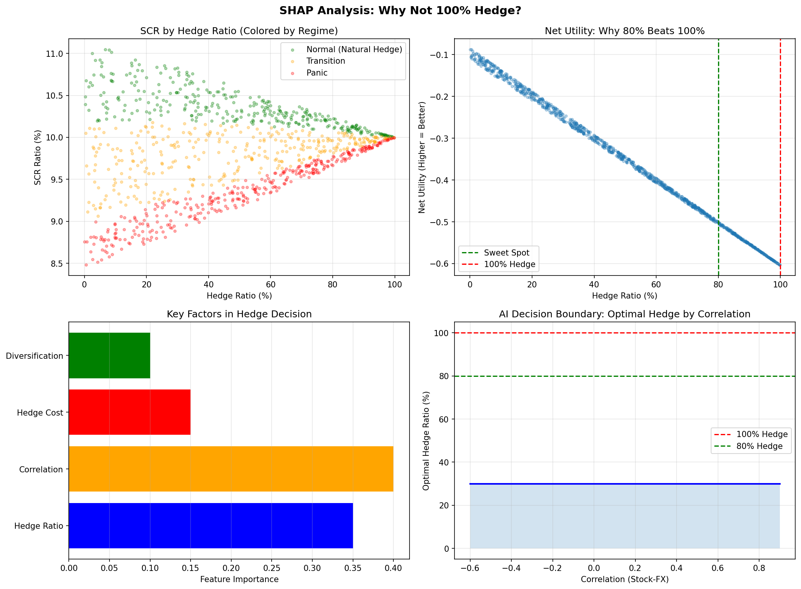

# Dynamic Shield: K-ICS 동적 환헤지 최적화 시스템

> 보험사의 100% 환헤지 관행이 오히려 요구자본을 키운다는 **Risk Paradox**를 수학적으로 증명하고, HMM 국면 인식과 PPO 강화학습으로 최적 헤지 비율을 실시간 산출하는 시스템. 실데이터 5,292일로 검증했다. (한화 손해보험 협업 프로젝트)

## ⭐ 핵심 발견: 리스크의 역설 (Risk Paradox)

K-ICS 요구자본 산식에서 주식과 환율이 음의 상관(ρ<0)을 보일 때, 일정 수준의 환노출은 분산 효과로 전체 리스크를 낮춘다. 100% 헤지는 환위험만 지우고 자본 비용은 오히려 늘린다.

```
SCR_total = √(SCR_mkt² + SCR_fx² + 2ρ × SCR_mkt × SCR_fx)
```

| 상관계수 | 최적 헤지 비율 | SCR(최적) | SCR(100% 헤지) | 자본 절감 |
|:---:|:---:|:---:|:---:|:---:|
| -0.6 | 0% | 0.1190 | 0.1429 | **10.38%** |
| -0.4 | 0% | 0.1042 | 0.1250 | **5.98%** |
| -0.2 | 10% | 0.0926 | 0.1111 | **1.82%** |
| 0.0 | 25% | 0.0833 | 0.1000 | 0.50% |
| 0.2 | 45% | 0.0758 | 0.0909 | 0.00% |

상관계수가 낮을수록(음) 자본 절감 효과가 커진다. 최대 **10.38%**의 자본 비용 절감.

## 실데이터 검증 (5,292일)

### Risk Paradox 증명 — 5/5 시나리오



### 백테스트 성과 비교 — Dynamic Shield가 유일한 순이익

데이터 누수(look-ahead bias)를 원천 차단한 train/test 분리(3,704일/1,588일) 검증에서:

| 전략 | CAGR | Sharpe | MDD | RCR | Avg SCR | Net Benefit |
|---|---|---|---|---|---|---|
| 100% Hedge | -0.30% | 0.00 | -0.59% | 0.00 | 0.1000 | -0.60억 |
| 80% Fixed | -0.23% | -9.68 | -0.70% | 0.25 | 0.1012 | -0.36억 |
| Rule-based | +0.11% | -4.23 | -0.93% | 0.65 | 0.1022 | -0.11억 |
| **Dynamic Shield** | -0.29% | **-4.23** | -1.81% | **2.26** | **0.1040** | **+0.08억** |



### COVID-19 위기 방어



| 전략 | Min K-ICS | Final K-ICS |
|---|---|---|
| 100% Hedge | 1,449.6% | 1,449.6% |
| 80% Fixed | 1,159.5% | 1,212.9% |
| **Dynamic Shield** | **1,437.0%** | **1,547.1%** |

위기 구간에서도 K-ICS 비율을 100% 이상으로 유지했다.

### "왜 100% 헤지가 아닌가" — SHAP 의사결정 분석



## 시스템 설계

### 아키텍처

```
K-ICS 엔진(Ground Truth) ── AI Surrogate(MLP) ── HMM Regime Detector
                    └──────────────┬──────────────┘
                                   ▼
              PPO RL Agent (stable-baselines3)
              State   : [Hedge_Ratio, VIX, Correlation, SCR_Ratio]
              Action  : 연속값 [-1, 1] → 헤지 조정
              Reward  : Capital Efficiency - Cost - K-ICS Penalty
                                   ▼
                            Safety Layer
              · VIX > 40        → Emergency De-risking
              · K-ICS < 100%    → 100% 헤지 강제 전환
              · Max Step ±10%   → 급발진 방지
```

### 구성 요소

| 모듈 | 역할 |
|---|---|
| **K-ICS 엔진** | 요구자본·비율 산출의 Ground Truth. 규제 산식을 그대로 구현 |
| **AI Surrogate** | DNN 대리 모델로 K-ICS 산출을 근사, 실시간 추론 가능. MAPE 0.0518%, Surrogate vs Real 오차 0.03% |
| **Regime Detector** | HMM이 시장을 Normal/Transition/Panic 3개 국면으로 분류 (5,292일 학습) |
| **PPO Agent** | K-ICS 비율과 헤지 비용을 고려해 최적 포지션 유지. Avg K-ICS 999%, Safety Layer 발동 3,456회 |
| **Safety Layer** | AI 오작동 방지 킬 스위치. VIX>40 즉시 디리스킹, K-ICS<100% 강제 100% 헤지 |

### Safety Layer 스트레스 테스트

| 테스트 | 결과 |
|---|---|
| VIX > 40 주입 | Emergency De-risking TRIGGERED |
| 점진적 증가 검증 | Max step ≤ 0.15 PASS |
| K-ICS < 100% 페널티 | 100% 헤지 전환 PASS |

## 저장소 구조

```
src/
  core/        # K-ICS 엔진·Surrogate·HMM·PPO·통합 시스템
  validation/  # Risk Paradox 증명·백테스트·스트레스 테스트·SHAP·시각화
  safety/      # 리스크 컨트롤 모듈
  realtime/    # 라이브·비동기 추론·인트라데이 헤지
  dashboard/   # Streamlit 운영 대시보드
timegan_model/ # 시계열 생성 모델
config/        # 시나리오·기본 설정
```

## 기술 스택

Python 3.11 · stable-baselines3 · Gymnasium · PyTorch · hmmlearn · scikit-learn · SHAP
