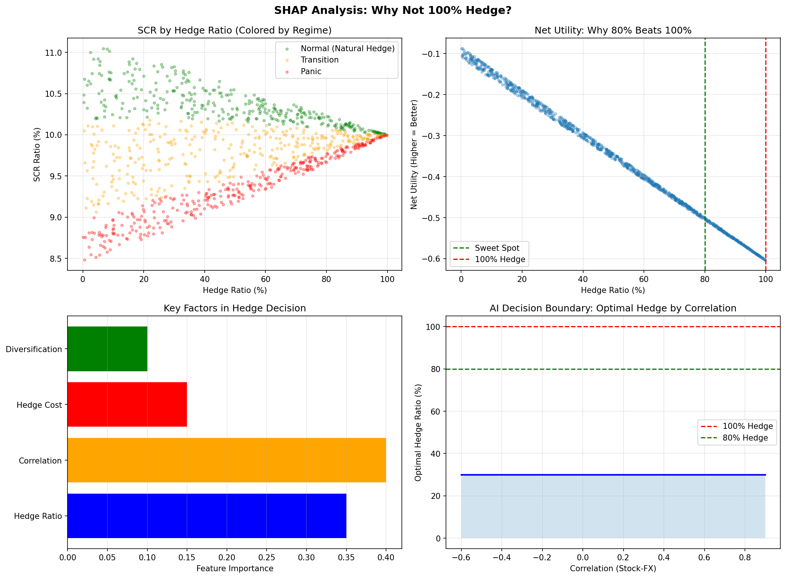
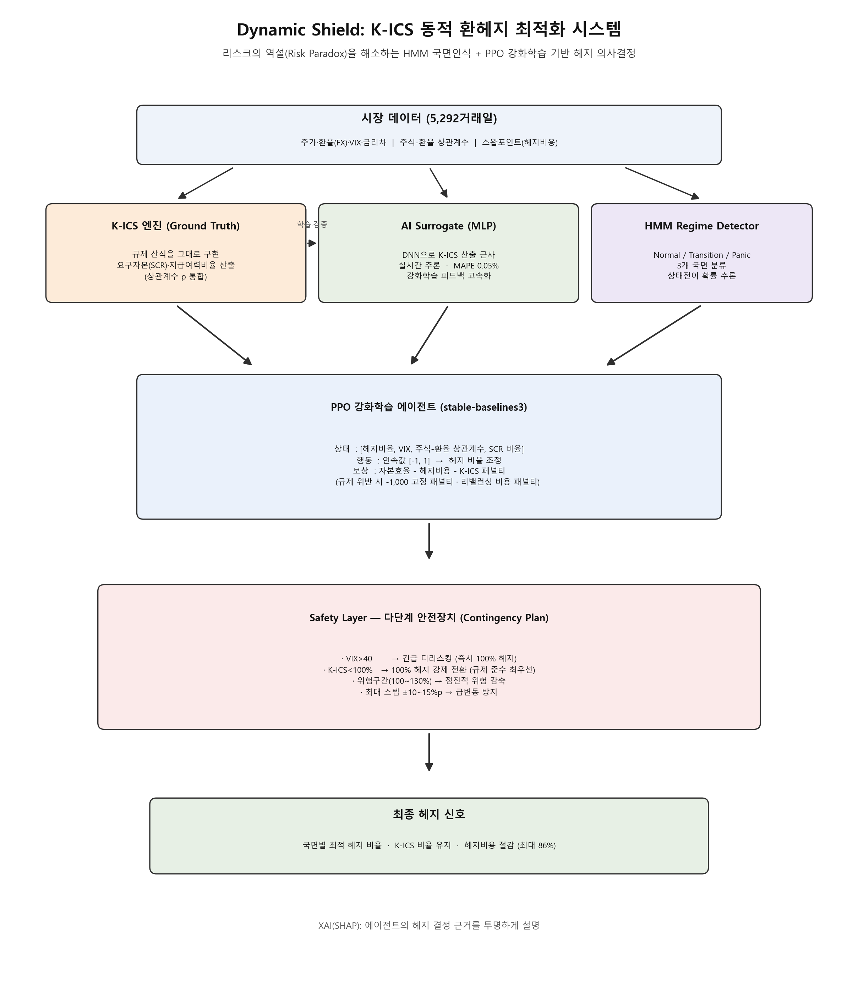

# K-ICS 동적 환헤지 최적화 시스템

## 📄 연구 보고서

- [**K-ICS 규제 환경 하 보험사의 동적 환위험 헤지 의사결정 시스템 (연구 보고서 PDF)**](./K-ICS%20규제%20환경%20하%20보험사의%20동적%20환위험%20헤지%20의사결정%20시스템.pdf)

> HY-FIN 재무금융학회 환헤지 연구. 상관관계에 따른 요구자본 변화와 헤지 비용을 분석하고, HMM 국면 인식과 PPO 강화학습으로 헤지 비율을 선택하는 연구용 시스템이다.

아래 수치는 연구 보고서에 기재된 결과를 요약했다. 이번 문서 정리에서는 실험을 재실행하지 않았으며, 실운용 성과나 현행 규제상 인정되는 자본 절감을 의미하지 않는다. 쪽수는 PDF의 물리 쪽수 기준이다.

## 상관관계와 환헤지 비율의 관계 (Risk Paradox)

보고서 §3.3은 주식과 환율이 음의 상관(ρ<0)을 보일 때 환노출의 분산 효과를 분석한다. 연구의 상관관계 가정에 따라 100% 헤지가 항상 가장 낮은 SCR을 만드는 것은 아니다.

```
SCR_total = √(SCR_mkt² + SCR_fx² + 2ρ × SCR_mkt × SCR_fx)
```

### 원문 Table 1 정오 확인 (p.6)

원문은 자본 절감률을 전액 헤지 대비 요구자본 감소율로 설명하지만, 표의 SCR 값과 기재된 절감률이 산술상 일치하지 않는다. 아래에서 원문 값과 표에 표시된 SCR만으로 계산한 값을 구분했다.

| 상관계수 | 원문 최적 헤지 비율 | 원문 SCR(최적) | 원문 SCR(100% 헤지) | 원문 절감률 | 표시 SCR로 산술 재계산 |
|:---:|:---:|:---:|:---:|:---:|:---:|
| -0.6 | 0% | 0.1190 | 0.1429 | 10.38% | 16.72% |
| -0.4 | 0% | 0.1042 | 0.1250 | 5.98% | 16.64% |
| -0.2 | 10% | 0.0926 | 0.1111 | 1.82% | 16.65% |

재계산식: `(SCR(100% 헤지) - SCR(최적 헤지)) / SCR(100% 헤지) × 100`.

**재계산 값은 원문 표의 산술 불일치를 보여주기 위한 값이며, 검증된 모델 성과나 정정된 절감률로 제시하지 않는다.** 어떤 원문 항목이 잘못되었는지는 원 실험의 실행 기록으로 확인해야 한다. 따라서 기존의 "최대 10.38% 절감"을 확정 성과로 사용하지 않는다. 원본 PDF는 수정하지 않고 역사적 연구 자료로 보존한다.

## 보고서의 테스트 구간 결과

보고서 §5.1은 과거 시장자료의 시계열 순서를 유지한 학습·테스트 분리와 12종 스트레스 시나리오를 설명한다. 다음 표는 §5.3 Table 2 (p.15)의 전 시나리오 평균, 테스트 구간 결과다.

| 전략 | RCR (자본 효율성 지표) | Net Benefit (순편익) |
|---|---|---|
| 100% Hedge | 0.00 | -0.60억 |
| 80% Fixed | 0.25 | -0.36억 |
| Rule-based | 0.65 | -0.11억 |
| **K-ICS 동적 환헤지** | **2.26** | **+0.08억** |

원문 표에서 자체 모델은 RCR이 가장 높고 순편익이 유일하게 양수다. 이 순위는 해당 지표와 연구의 테스트 조건에 한정된다. RCR은 §5.2의 **Modified Sharpe Ratio for Capital Efficiency**에 대응하는 자본 효율성 지표이며, 자산 수익률의 일반적인 Sharpe와 구분한다. 이 표는 평균 SCR·CAGR·MDD의 우위를 뒷받침하지 않는다.

기존 README의 별도 수치 요약에는 재현 가능한 실행 기록과 실험 조건이 연결되어 있지 않아 대표 결과에서 제외했다. 특히 기존 표의 Avg SCR은 자체 모델 0.1040, 100% Hedge 0.1000으로, 자체 모델의 평균 SCR이 가장 낮다는 해석을 지지하지 않았다.

### COVID-19 위기 방어

출처: 보고서 §5.5 Table 3 (p.16). 원문 표에 기재된 위기 구간의 최저 K-ICS 비율만 옮겼다.

| 전략 | Min K-ICS |
|---|---|
| 100% Hedge | 1,449.6% |
| 80% Fixed | 1,159.5% |
| K-ICS 동적 환헤지 | 1,248.7% |

보고서의 위기 구간에서 세 전략 모두 연구에 설정된 100% 하한을 넘었다. 자체 모델의 최저 비율은 100% Hedge보다 낮으므로, 모든 위험 지표에서 가장 좋았다는 뜻은 아니다.

### 해석의 한계

보고서 §6.2-6.3 (p.19)은 데이터·자산 구성·시장 가정에 따른 결과 의존성을 명시한다. 거래 비용과 슬리피지를 일부 반영했으나, 실제 유동성·수수료·시장 충격 비용은 추가 검증이 필요하다. 시장에서 관찰된 상관관계의 분산 효과가 규제상 SCR 절감으로 그대로 인정된다고 해석할 수 없다.

### "왜 100% 헤지가 아닌가", SHAP 의사결정 분석



## 시스템 설계

### 아키텍처

<p align="center">
  
</p>


### 구성 요소

| 모듈 | 역할 |
|---|---|
| **K-ICS 엔진** | 연구 가정에 따른 요구자본·비율을 산출하는 기준 엔진 |
| **AI Surrogate** | DNN 대리 모델로 기준 엔진의 SCR 산출을 근사해 반복 정책 학습의 연산 비용을 줄인다 |
| **Regime Detector** | HMM이 시장을 정상/전환/패닉 3개 국면으로 분류한다 |
| **PPO Agent** | K-ICS 비율과 헤지 비용을 함께 고려해 헤지 비율을 선택한다 |
| **Safety Layer** | VIX·K-ICS 비율에 따라 PPO의 제안을 수정하는 다단계 안전장치 |

### 보고서의 Safety Layer 설계

출처: 보고서 §4.5 (pp.11-12). 아래는 연구에서 설정한 제어 규칙이며, 이번 문서 정리에서 새로 수행한 스트레스 테스트 결과가 아니다.

| 조건 | 제어 규칙 |
|---|---|
| VIX>40 | 100% 헤지 전환 |
| 1회 리밸런싱 | 헤지 비율 변동 폭을 15%p 이내로 제한 |
| K-ICS<100% | PPO 제안과 무관하게 100% 헤지 강제 |

## 저장소 구조

```
src/
  core/        # K-ICS 엔진·Surrogate·HMM·PPO·통합 시스템
  validation/  # Risk Paradox 증명·백테스트·스트레스 테스트·SHAP·시각화
  safety/      # 리스크 컨트롤 모듈
  realtime/    # 라이브·비동기 추론·인트라데이 헤지
  dashboard/   # Streamlit 운영 대시보드
timegan_model/ # 시계열 생성 모델
config/        # 시나리오·기본 설정
```

## 기술 스택

Python 3.11 · stable-baselines3 · Gymnasium · PyTorch · hmmlearn · scikit-learn · SHAP
